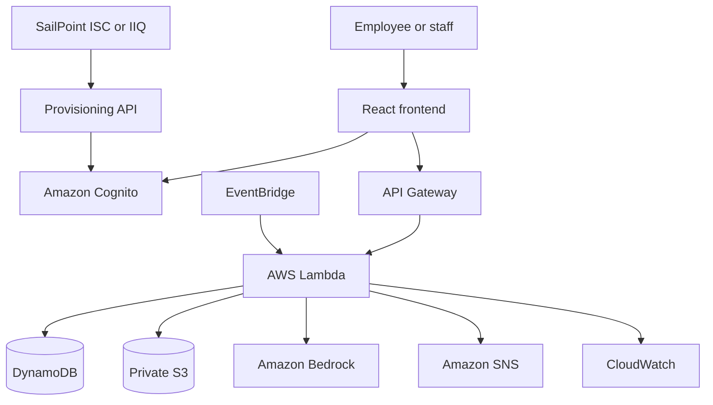

# Architecture

## Week 1 request flow

1. React redirects unauthenticated users to the Cognito authentication experience.
2. Cognito issues an ID token containing identity and group claims.
3. React sends the token in the API `Authorization` header.
4. API Gateway validates the token through the Cognito authorizer.
5. Lambda checks the role and the user's relationship to the requested asset.
6. Lambda validates input and reads or writes DynamoDB.
7. CloudWatch receives operational logs without request bodies, tokens, or private asset data.

## Target architecture

## SailPoint extension

SailPoint is the governance control plane. Cognito remains the authentication and token service required by the application. A later machine-to-machine provisioning API will expose narrowly scoped operations for aggregation, account enable/disable, and group membership. Its Lambda execution role will be limited to the required Cognito administrative APIs.

## IAM least privilege

Every Lambda has its own execution role defined inline in `infrastructure/template.yaml`. Each role is granted only the actions its handler calls, scoped to specific resources. The daily maintenance check (EventBridge schedule) and the maintenance SNS topic are template-managed. Neither needs a manual post-deploy step.

| Function | Actions | Resources |
|---|---|---|
| `AssetApiFunction` | `dynamodb:GetItem`, `PutItem`, `DeleteItem`, `Scan`, `Query`, `TransactWriteItems` | Asset table |
| | `dynamodb:Query` | Asset table indexes (`DepartmentIndex`, `AssignedUserIndex`) |
| | `s3:GetObject` (presigned photo URLs, and the source of a photo claim) | Photo bucket `pending/*`, `claimed/*`, `assets/*` |
| | `s3:DeleteObject` (removes a pending photo once claimed) | Photo bucket `pending/*` |
| | `s3:PutObject` (claimed photo copy) | Photo bucket `claimed/*` |
| | `bedrock:InvokeModel` | Nova Lite inference profile, plus its foundation models when called through that profile |
| `PhotoUploadFunction` | `s3:PutObject` (presigned POST) | Photo bucket `pending/*` |
| `PhotoAnalysisFunction` | `s3:GetObject` | Photo bucket `pending/*` |
| | `dynamodb:PutItem`, `UpdateItem` | Asset table |
| | `bedrock:InvokeModel` | Nova Lite inference profile, plus its foundation models when called through that profile |
| `PhotoAnalysisApiFunction` | `dynamodb:GetItem` | Asset table |
| `MaintenanceSchedulerFunction` | `dynamodb:Scan`, `Query` | Asset table |
| | `sns:Publish` | Maintenance notification topic |
| `HealthFunction` | none | none |

`PhotoAnalysisFunction` builds the bucket ARN from the bucket name instead of using `!GetAtt`. The bucket's S3 event notification already depends on the function, so `!GetAtt` would create a circular dependency.

`AssetApiFunction` needs `DeleteItem` for three paths: changing an asset tag removes the old tag reservation in the same transaction, changing a maintenance record's performed date moves it to a new sort key and deletes the old item, and an Administrator can delete a maintenance record.

When an asset is saved with a `pending/` photo, `AssetApiFunction` copies it to `claimed/` so the 7-day `pending/` lifecycle rule cannot expire it, then deletes the pending copy.

The photo bucket and the maintenance topic both deny requests that are not made over TLS. The maintenance topic is also encrypted with the AWS-managed SNS key.

The daily schedule retries delivery to `MaintenanceSchedulerFunction` up to twice within an hour. Events that still cannot be delivered go to an SQS dead-letter queue that SAM creates. Errors raised inside the function are retried by Lambda's asynchronous invocation instead.
